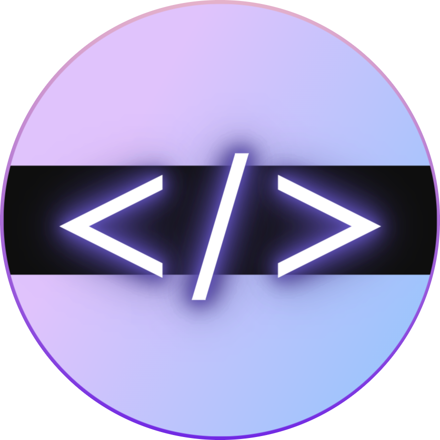
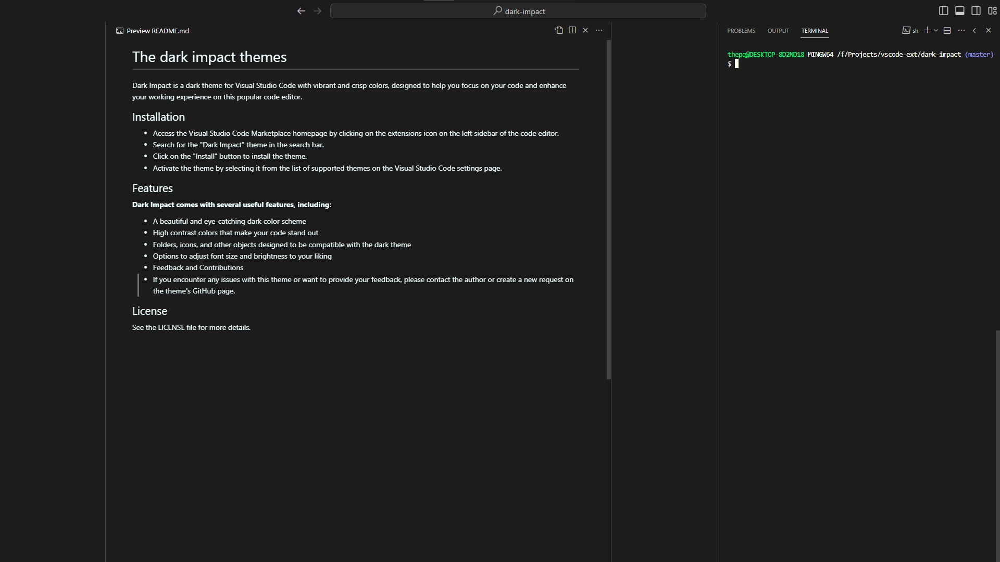

<!-- Header page -->
<div align=center>
    
    <h1>The dark impact theme</h1>
    <p>🎉 Coding is just for fun and happy 🎉</p>
</div>

<!-- Badge -->


<!-- Contents -->
---
> The Dark Impact is a dark theme for Visual Studio Code with support glow syntax. The theme adds inspiration to your coding experience, highlighting your code snippets with a glowing style featuring shades of purple and white as the main colors.

<p align="center">
    
</p>

---
## Features
**Dark Impact comes with several useful features, including:**
- A beautiful and eye-catching dark color scheme
- Supports glow effect to highlight code sections containing functions, numbers.
- Not too many colors to make it easy for you to distinguish and not strain your eyes.
- Supports customizable colors suitable for many languages such as `PHP`, `Python`, `JavaScript`, ...

## List of theme
- The dark impact theme default.

## Installation
- You can download or install the theme by [The dark impact theme](https://marketplace.visualstudio.com/items?itemName=thep200.the-dark-impact) or access the Visual Studio Code Marketplace homepage by clicking on the extensions icon on the left sidebar of the code editor.
- Search for the `Dark Impact` theme in the search bar.
- Click on the `Install` button to install the theme.
- Activate the theme by press `Ctrl + shift + p` and input `Color Theme` choose `Dark impact`.
- To enable glow syntax see tag [Glow](#glow) below


## Glow
Currently, `Dark Impact` does not directly support highlighting code with the glow effect. However, I have written CSS code to customize the use of the glow effect in the future when this feature is integrated into `Dark Impact`. To use this feature now, please follow the instructions below:

- Installs [Custom Css and JS Loader](https://marketplace.visualstudio.com/items?itemName=be5invis.vscode-custom-css) extension.
- Open `settings.json` file in your workspace and append this config:
```json
// Window
"vscode_custom_css.imports": [
    "file:///C:/Users/<user_name>/.vscode/extensions/thep200.the-dark-impact-1.2.0/assets/assets/css/glow.css",
],

// Mac
"vscode_custom_css.imports": [
    "file:///Users/.vscode/extensions/thep200.the-dark-impact-1.2.0/assets/assets/css/glow.css",
],
```
> **Tip** To put it simply, I have prepared a `glow.css` file in the assets folder of the extension. Please find the path of the file and add it to the configuration above.
- Press `Ctrl + shift + p` and `Reload Custom Css and JS`.
- Good luck!.

## Futures
In the future, I will integrate the glow feature into `Dark Impact` without the need for third-party extensions. Additionally, I will design additional themes for different programming languages.

## Supports
- Support channel will be here soon.

## License
See the LICENSE file for more details.